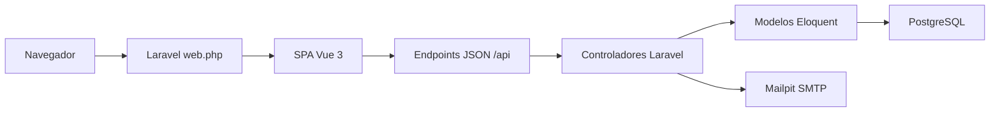
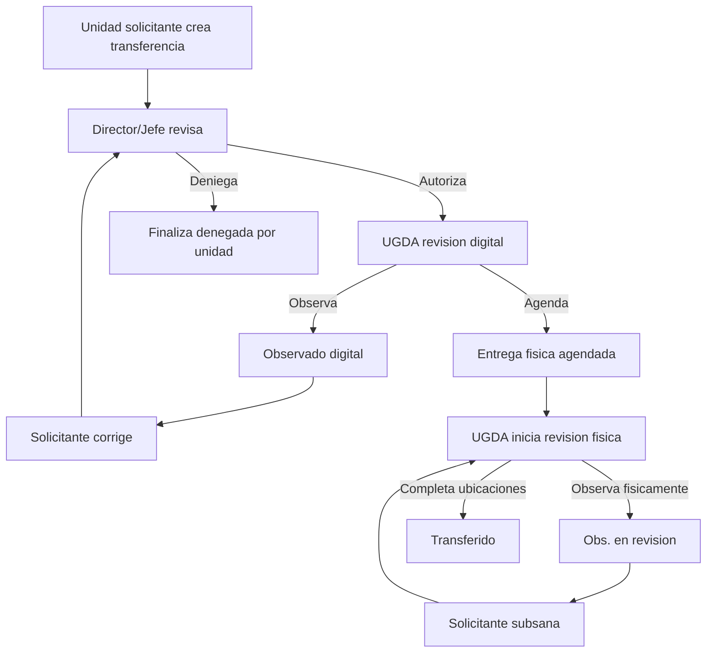

# Sistema UGDA FIA UES - Documentacion tecnica

## 1. Proposito del sistema

Sistema UGDA FIA UES es una SPA administrativa para gestionar procesos de la Unidad de Gestion Documental y Archivos. La aplicacion cubre autenticacion con segundo factor, administracion de catalogos, solicitudes de transferencia documental, prestamos, archivo general, ubicaciones fisicas, notificaciones, reportes y perfil de usuario.

La rama actual usa:

- Backend: Laravel 12.
- Frontend: Vue 3 con Vue Router.
- UI: PrimeVue, PrimeIcons y PrimeFlex.
- Build: Vite.
- Base de datos: PostgreSQL 16 en ejecucion normal; SQLite en memoria para PHPUnit.
- Correo local: Mailpit.
- Pruebas backend: PHPUnit.
- Pruebas E2E: Playwright.

## 2. Arquitectura general

La aplicacion esta organizada como SPA servida por Laravel. Laravel entrega `resources/views/welcome.blade.php` para las rutas de entrada y expone endpoints JSON bajo `/api/...` definidos en `routes/web.php`. Vue Router controla las rutas del lado cliente.

Flujo general:



Puntos transversales:

- `bootstrap/app.php` registra rutas web, health check `/up`, middleware `SanitizeTextInput` y alias `permission`.
- `SanitizeTextInput` limpia entradas de query y body: elimina scripts, handlers `on...`, protocolos `javascript:`/`vbscript:`, tags HTML y emojis.
- `EnsureUserHasPermission` valida permisos por nombre de rol/permiso usando `User::hasPermission()`.
- La sesion se maneja por cookie de Laravel y el frontend consulta `/api/user` para conocer usuario, perfil, unidad y permisos.

## 3. Estructura tecnica principal

### Backend

- `routes/web.php`: rutas publicas, rutas protegidas por `auth`, endpoints internos JSON y catch-all SPA.
- `app/Http/Controllers`: controladores por modulo.
- `app/Models`: modelos Eloquent.
- `app/Support/RequestCatalog.php`: ensamblador central de payloads de solicitudes, detalle de transferencia/prestamo, dashboard y permisos visuales por perfil.
- `app/Services`: servicios de codigos autenticador, notificaciones y bitacora.
- `database/migrations`: esquema relacional.
- `database/seeders`: catologos, perfiles, permisos, usuarios base y datos demo.

### Frontend

- `resources/js/app.js`: bootstrap Vue, PrimeVue, router, servicios y estilos.
- `resources/js/router.js`: rutas SPA y guard de autenticacion/permisos.
- `resources/js/components/App.vue`: shell principal.
- `resources/js/components/layout`: layout administrativo y sidebar.
- `resources/js/components/views`: pantallas funcionales.
- `resources/js/components/shared`: componentes compartidos, por ejemplo `DocumentPreviewDialog.vue`.
- `resources/css/app.css`: estilos globales, tokens visuales y overrides PrimeVue.
- `resources/js/inputSanitizer.js`: sanitizacion del lado cliente.

## 4. Autenticacion y autorizacion

### Endpoints publicos

- `POST /login-auth`: valida correo/password, genera codigo 2FA y lo envia por correo.
- `POST /login-verify`: valida codigo 2FA e inicia sesion.
- `POST /login-change-password`: completa cambio de password temporal.
- `GET /logout`: cierra sesion.
- `GET /login`: entrega la SPA para la pantalla de login.

### Flujo 2FA

1. Usuario envia credenciales a `/login-auth`.
2. `AuthController::login()` valida usuario activo, password, bloqueo por intentos y metodo 2FA.
3. Se genera codigo por correo o se usa autenticador segun configuracion.
4. El frontend muestra paso de verificacion.
5. `/login-verify` inicia la sesion y devuelve redireccion.

### Modelo de usuario normalizado

`users` no usa columna `name`. La identidad personal vive en `person`.

Campos clave:

- `users`: `email`, `password`, `is_active`, campos 2FA, campos de password temporal, `last_login_at`.
- `person`: `first_name`, `second_name`, `first_last_name`, `second_last_name`, `carnet`.
- `user_profile`: perfiles asignados.
- `user_unit`: unidades asignadas.

### Perfiles principales

- `Administrador`: acceso administrativo completo.
- `Usuario UGDA`: operaciones UGDA, reportes y gestion documental.
- `Unidad Solicitante`: crea y da seguimiento a solicitudes.
- `Director/Jefe de Unidad`: revisa y autoriza solicitudes de su unidad.

### Permisos

Los permisos se guardan como roles con nombre tecnico, por ejemplo:

- `endpoint.api.user.read`
- `endpoint.api.users.create`
- `endpoint.api.units.update`
- `endpoint.api.documentary-series.read`
- `endpoint.ui.reports.read`

`EndpointRoleSeeder` asigna estos permisos a los perfiles.

## 5. Rutas backend principales

### Usuario, perfil y seguridad

- `GET /api/user`: payload normalizado del usuario autenticado.
- `GET /api/profiles`: perfiles disponibles.
- `GET /api/profile`: perfil completo, unidades, notificaciones y actividad.
- `POST /api/profile/password`: cambio de password.
- `POST /api/profile/two-factor`: cambia metodo 2FA.
- `POST /api/profile/two-factor/authenticator/prepare`: prepara TOTP.
- `POST /api/profile/two-factor/authenticator/confirm`: confirma TOTP.

### Administracion

- `GET|POST|PUT|DELETE /api/units`: CRUD de unidades.
- `GET|POST|PUT|DELETE /api/users`: CRUD de usuarios y borrado logico.
- `POST /api/users/{id}/reset-password`: reinicio de password temporal.
- `GET|POST|PUT|DELETE /api/documentary-series`: CRUD de series.
- `POST /api/documentary-series/{seriesId}/subseries`: crear subserie.
- `PUT|DELETE /api/documentary-subseries/{id}`: editar/eliminar subserie.

### Solicitudes y dashboard

- `GET /api/request-catalog`: listado consolidado de transferencias y prestamos.
- `GET /api/dashboard-summary`: resumen para dashboard.
- `GET /api/reports/summary`: reportes dinamicos.
- `GET /api/notifications`: notificaciones.
- `GET /api/notifications/summary`: contador/resumen.
- `POST /api/notifications/{id}/read`: marcar una como leida.
- `POST /api/notifications/mark-all-read`: marcar todas como leidas.

### Transferencias documentales

- `GET /api/transfers/next-code`: siguiente correlativo.
- `GET /api/transfers/document-import-template`: plantilla de importacion.
- `POST /api/transfers/import-documents`: parsea documentos desde archivo.
- `POST /api/transfers`: crea transferencia.
- `GET /api/transfers/{number}`: detalle de transferencia.
- `GET /api/transfers/{number}/edit-data`: datos para corregir observaciones.
- `PUT /api/transfers/{number}/resubmit-correction`: reenvia correcciones.
- `POST /api/transfers/{number}/unit-authorize`: autorizacion de jefatura.
- `POST /api/transfers/{number}/unit-deny`: rechazo de jefatura.
- `POST /api/transfers/{number}/schedule`: agenda entrega fisica.
- `POST /api/transfers/{number}/start-physical-review`: inicia revision fisica.
- `POST /api/transfers/{number}/complete-locations`: completa ubicaciones fisicas.
- `POST /api/transfers/{number}/observe`: registra observación UGDA o fisica.
- `POST /api/transfers/{number}/deny`: deniega transferencia desde UGDA.
- `GET /api/transfers/{number}/documents/{code}/download`: descarga/visualiza documento.
- `GET /api/transfers/{number}/boxes/{boxNumber}/label`: payload de etiqueta QR.

### Prestamos

- `GET /api/loans/create/catalog`: catalogo de documentos prestables.
- `GET /api/loans/pending-authorization`: prestamos pendientes de jefatura.
- `POST /api/loans`: crea prestamo.
- `GET /api/loans/{number}`: detalle de prestamo.
- `POST /api/loans/{number}/unit-authorize`: jefatura autoriza.
- `POST /api/loans/{number}/unit-deny`: jefatura deniega.
- `POST /api/loans/{number}/authorize`: UGDA autoriza.
- `POST /api/loans/{number}/observe`: UGDA observa.
- `POST /api/loans/{number}/deny`: UGDA deniega.
- `POST /api/loans/{number}/search/start`: inicia busqueda fisica.
- `POST /api/loans/{number}/search/finish`: termina busqueda.
- `POST /api/loans/{number}/register`: registra prestamo/entrega.
- `POST /api/loans/{number}/document-modifications`: registra modificaciones.
- `POST /api/loans/{number}/return`: registra devolucion.

### Archivo y ubicaciones

- `GET /api/archive/catalog`: catalogo base de archivo.
- `GET|POST|DELETE /api/archive/boxes`: consulta, crea y elimina cajas.
- `GET /api/archive/documents`: busqueda del archivo general.
- `GET /api/physical-locations/options`: opciones de oficinas, pasillos y estantes.
- `GET /api/physical-locations`: catalogo completo.
- `POST|PUT|DELETE /api/physical-location-offices`: oficinas.
- `POST|PUT|DELETE /api/physical-location-aisles`: pasillos.
- `POST|PUT|DELETE /api/physical-location-shelves`: estantes.

## 6. Rutas frontend y vistas

`resources/js/router.js` define:

- `/login` -> `Login.vue`.
- `/dashboard` -> `Dashboard.vue`.
- `/unidades` -> `Unidades.vue`.
- `/usuarios` -> `Usuarios.vue`.
- `/series-documentales` -> `SeriesDocumentales.vue`.
- `/archivo-general` -> `ArchivoGeneral.vue`.
- `/archivo-general/gestion` -> `ArchivoGestion.vue`.
- `/archivo-general/cajas/crear` -> `CrearCajaArchivo.vue`.
- `/archivo-general/ubicaciones` -> `UbicacionesFisicas.vue`.
- `/reportes` -> `Reportes.vue`.
- `/notificaciones` -> `Notificaciones.vue`.
- `/mi-perfil` -> `MiPerfil.vue`.
- `/solicitudes` -> `Solicitudes.vue`.
- `/solicitudes/crear` -> `NuevaSolicitud.vue`.
- `/solicitudes/prestamos/crear` -> `SolicitudPrestamo.vue`.
- `/solicitudes/prestamos/pendientes` -> `PrestamosPendientesAutorizacion.vue`.
- `/solicitudes/transferencias/:number/editar` -> `NuevaSolicitud.vue`.
- `/solicitudes/transferencias/:number/proceso` -> `DetalleTransferencia.vue`.
- `/solicitudes/transferencias/:number` -> `DetalleTransferencia.vue`.
- `/etiquetas/transferencias/:number/cajas/:boxNumber` -> `EtiquetaTransferencia.vue`.
- `/solicitudes/prestamos/:number` -> `DetallePrestamo.vue`.

El guard de router:

- Permite `/login`.
- Consulta `/api/user` con `getCurrentUser({ force: true })`.
- Verifica `meta.permission` contra `user.permissions`.
- Verifica `meta.allowedProfiles` contra el perfil activo.
- Si falla autenticacion, redirige a `/login?redirect=<ruta-original>`.

## 7. Controladores

### AuthController

Responsable de login, 2FA, cambio de password temporal, logout y bloqueo por intentos.

Metodos:

- `login()`: valida credenciales y genera desafio 2FA.
- `completeTemporaryPassword()`: obliga cambio si existe password temporal.
- `verify2FA()`: verifica codigo y autentica.
- `logout()`: invalida sesion.

### UserController

CRUD de usuarios normalizados.

Metodos:

- `index()`: lista usuarios con persona, perfil y unidades.
- `store()`: crea `users`, `person`, asigna perfil y unidades.
- `update()`: actualiza datos personales, perfil, unidad y estado.
- `resetPassword()`: genera password temporal y envia correo.
- `destroy()`: desactiva/elimina logicamente.

### UnitController

CRUD simple de unidades.

- `index()`
- `store()`
- `update()`
- `destroy()`

### DocumentarySeriesController

Gestiona series y subseries documentales.

- `index()`
- `store()`
- `update()`
- `destroy()`
- `storeSubseries()`
- `updateSubseries()`
- `destroySubseries()`

### TransferController

Controla el ciclo de vida transaccional de transferencias.

Metodos publicos:

- `nextCode()`: genera siguiente codigo.
- `documentImportTemplate()`: descarga plantilla.
- `importDocuments()`: importa documentos desde archivo.
- `store()`: crea transferencia, cajas y documentos.
- `editData()`: payload para correccion de solicitud observada.
- `resubmitCorrection()`: reenvio por solicitante despues de observacion.
- `authorizeByUnit()` / `denyByUnit()`: decision de Director/Jefe.
- `schedule()`: UGDA agenda entrega fisica.
- `startPhysicalReview()`: UGDA inicia revision fisica.
- `observeReview()`: observa revision digital o fisica segun estado.
- `completeLocations()`: asigna ubicaciones fisicas y completa transferencia.
- `deny()`: deniega desde UGDA.

Reglas importantes:

- La observación digital usa estado `transfer_status_observed`.
- La observación fisica usa estado `transfer_status_physical_observed` y `context.observation_scope = physical_review`.
- Al corregir observación digital, la solicitud vuelve a `transfer_status_pending` y genera evento `Corregido y reenviado`.
- Al corregir observación fisica, la solicitud pasa a `transfer_status_subsanated` y genera evento `Subsanada`.

### RequestCatalogController

Expone payloads de lectura preparados por `RequestCatalog`.

- `index()`: catalogo consolidado.
- `showTransfer()`: detalle de transferencia.
- `showTransferBoxLabel()`: etiqueta protegida de caja.
- `showLoan()`: detalle de prestamo.
- `downloadTransferDocument()`: archivo de documento.
- `dashboard()`: resumen de dashboard.

### LoanController

Controla solicitudes de prestamo.

- `createCatalog()`
- `store()`
- `pendingAuthorization()`
- `authorizeByUnit()`
- `denyByUnit()`
- `authorizeLoan()`
- `observe()`
- `deny()`
- `startSearch()`
- `finishSearch()`
- `registerLoan()`
- `registerDocumentModifications()`
- `registerReturn()`

### ArchiveController

Controla archivo general.

- `catalog()`
- `boxes()`
- `storeBox()`
- `destroyBox()`
- `documents()`

### PhysicalLocationController

Gestiona catalogo fisico:

- `index()`
- `options()`
- `storeOffice()`, `updateOffice()`, `destroyOffice()`
- `storeAisle()`, `updateAisle()`, `destroyAisle()`
- `storeShelf()`, `updateShelf()`, `destroyShelf()`

### Otros controladores

- `ProfileController`: lista perfiles.
- `UserProfileController`: perfil, password, 2FA y actividad.
- `SystemNotificationController`: notificaciones.
- `ReportController`: resumen dinamico.
- `HomeController`: vistas heredadas.

## 8. Modelos principales y relaciones

### Identidad y permisos

- `User`: usuario autenticable. Relaciones `person()`, `profiles()`, `units()`, `systemNotifications()`, `activityLogs()`.
- `Person`: datos personales normalizados.
- `Profile`: perfil funcional.
- `Role`: rol/permiso.
- `Unit`: unidad organizativa; puede tener jerarquia por dependencias.

### Transferencias

- `Transfer`: cabecera de solicitud. Relaciona solicitante, unidad, estados, autorizador, completador, cajas y eventos.
- `TransferBox`: caja documental asociada a transferencia.
- `TransferDocument`: documento dentro de caja.
- `TransferEvent`: historial de estados, decisiones y observaciones.

### Prestamos

- `Loan`: cabecera del prestamo.
- `LoanDocument`: documento solicitado.
- `LoanEvent`: historial.
- `LoanDispatch`, `LoanDispatchItem`: entrega/prestamo.
- `LoanReturn`, `LoanReturnItem`: devolucion.
- `LoanDocumentModification`: modificaciones registradas.

### Catalogos y soporte

- `RequestStatusCatalog`: catalogo de estados por tipo y categoria.
- `DocumentarySeries`, `DocumentarySubseries`: cuadro documental.
- `PhysicalLocationOffice`, `PhysicalLocationAisle`, `PhysicalLocationShelf`: ubicaciones fisicas.
- `SystemNotification`: notificaciones.
- `UserActivityLog`: bitacora de usuario.

## 9. Estados de negocio

### Transferencias

Autorizacion:

- `transfer_auth_pending`: pendiente de Director/Jefe.
- `transfer_auth_authorized`: autorizada.
- `transfer_auth_denied`: denegada.

Workflow:

- `transfer_status_pending`: pendiente.
- `transfer_status_observed`: observada en revision digital UGDA.
- `transfer_status_scheduled`: entrega fisica agendada.
- `transfer_status_physical_review`: revision fisica iniciada.
- `transfer_status_physical_observed`: observada en revision fisica.
- `transfer_status_subsanated`: observaciones fisicas subsanadas.
- `transfer_status_transferred`: transferida.
- `transfer_status_denied`: denegada.
- `transfer_status_cancelled`: cancelada.

Flujo resumido:



Regla corregida recientemente:

- Las aclaraciones de `Corregido y reenviado` se muestran antes de agenda como informacion para Director/Jefe y UGDA.
- Las observaciones digitales ya corregidas no se muestran como observaciones fisicas.
- `physicalObservations` solo usa eventos con `context.observation_scope = physical_review`.
- El boton de corregir por revision fisica solo aparece cuando el estado es `transfer_status_physical_observed`.

### Prestamos

Autorizacion:

- `loan_auth_pending`
- `loan_auth_authorized`
- `loan_auth_denied`

Workflow:

- `loan_status_pending`
- `loan_status_authorized`
- `loan_status_observed`
- `loan_status_loaned`
- `loan_status_returned`
- `loan_status_denied`
- `loan_status_cancelled`

Busqueda:

- `loan_search_in_progress`
- `loan_search_completed`
- `loan_search_not_found`

## 10. Base de datos

Tablas de identidad:

- `users`
- `person`
- `units`
- `unit_dependencies`
- `profiles`
- `roles`
- `profile_role`
- `user_profile`
- `user_unit`
- `user_activity_logs`

Tablas documentales:

- `documentary_series`
- `documentary_subseries`
- pivotes de series/subseries por unidad.

Tablas de transferencias:

- `transfers`
- `transfer_boxes`
- `transfer_box_documents`
- `transfer_events`

Tablas de prestamos:

- `loans`
- `loan_documents`
- `loan_events`
- `loan_dispatches`
- `loan_dispatch_items`
- `loan_returns`
- `loan_return_items`
- `loan_document_modifications`

Tablas de archivo y ubicaciones:

- `physical_location_offices`
- `physical_location_aisles`
- `physical_location_shelves`
- tablas/campos de archivo derivados de transferencias completadas y cajas.

Tablas de sistema:

- `request_status_catalogs`
- `system_notifications`
- tablas Laravel base: cache, jobs, sessions segun configuracion.

## 11. Seeders

- `RoleSeeder`: roles base.
- `ProfileSeeder`: perfiles funcionales.
- `ProfileRoleSeeder`: enlaza cada perfil con su rol funcional.
- `EndpointRoleSeeder`: permisos endpoint y asignacion por perfil.
- `DocumentarySeriesSeeder`: series/subseries base.
- `RequestStatusCatalogSeeder`: estados de transferencias y prestamos.
- `DatabaseSeeder`: ejecuta seeders base, crea usuarios demo/base y luego `RequestWorkflowDemoSeeder`.
- `RequestWorkflowDemoSeeder`: datos demo de transferencias/prestamos.
- `SystemNotificationDemoSeeder`: notificaciones demo.
- `AdminOnlySeeder`: instalacion limpia; ejecuta catalogos base y crea solo la unidad UGDA y el usuario administrador general.

Importante para instalacion limpia: si se necesita solo un admin, no usar `DatabaseSeeder` completo; ejecutar `AdminOnlySeeder`.

## 12. Servicios

- `AuthenticatorCodeService`: genera y valida secretos/codigos de autenticador.
- `SystemNotificationService`: crea notificaciones de eventos de transferencia/prestamo.
- `UserActivityLogger`: registra actividad relevante de usuarios.
- `RequestNumberGenerator`: genera correlativos de solicitudes.
- `RequestCatalog`: soporte central para payloads de listados, detalles, dashboard, permisos y tarjetas visuales.

## 13. Pruebas

### Configuracion

`phpunit.xml` define:

- `APP_ENV=testing`
- `DB_CONNECTION=sqlite`
- `DB_DATABASE=:memory:`
- `MAIL_MAILER=array`
- `QUEUE_CONNECTION=sync`
- `SESSION_DRIVER=array`

Esto hace que las pruebas backend sean aisladas y no usen PostgreSQL.

### Comandos recomendados

En esta maquina, usar Docker porque el host Windows no siempre tiene `php` o `npm` en PATH.

Backend completo:

```bash
docker compose exec -T app php artisan test
```

Archivo especifico:

```bash
docker compose exec -T app php artisan test tests/Feature/RequestCatalogTest.php
```

Filtro por nombre:

```bash
docker compose exec -T app php artisan test --filter=nombre_del_test
```

Lint PHP:

```bash
docker compose exec -T app php -l app/Support/RequestCatalog.php
```

Build frontend:

```bash
docker compose exec -T vite npm run build
```

E2E:

```bash
docker compose exec -T vite npm run test:e2e:install
docker compose exec -T vite npm run test:e2e
```

### Tests unitarios

`tests/Unit/ExampleTest.php`

- `test_that_true_is_true`: prueba placeholder de PHPUnit.

### Feature: ExampleTest

`tests/Feature/ExampleTest.php`

- `test_the_application_returns_a_successful_response`: valida que la raiz responda exitosamente.

### Feature: NormalizedAuthAndUserManagementTest

Cubre autenticacion, usuario normalizado, perfiles, permisos, unidades y series.

- `test_database_seeder_creates_admin_with_person_and_profile`: verifica admin sembrado con persona y perfil.
- `test_login_auth_sends_two_factor_code_for_normalized_user`: valida envio de codigo 2FA.
- `test_verify_2fa_logs_in_normalized_user`: valida login con codigo.
- `test_api_user_returns_normalized_payload`: valida payload de `/api/user`.
- `test_store_user_creates_person_and_profile_without_breaking_payload_shape`: crea usuario normalizado.
- `test_update_user_moves_person_data_and_profile_assignment`: actualiza persona/perfil/unidad.
- `test_delete_unit_soft_deletes_it_and_hides_it_from_listing`: soft delete de unidad.
- `test_profiles_endpoint_returns_available_profiles_for_admin`: perfiles disponibles.
- `test_documentary_series_endpoint_returns_series_ordered_by_code`: orden de series.
- `test_admin_can_create_documentary_subseries`: creacion de subserie.
- `test_admin_can_create_documentary_series_with_variable_length_numeric_code`: codigo de serie variable.
- `test_documentary_series_name_must_be_unique`: nombre unico de serie.
- `test_admin_can_create_documentary_subseries_with_variable_length_numeric_code`: codigo variable en subserie.
- `test_documentary_subseries_name_must_be_unique_inside_the_same_series`: nombre unico dentro de serie.
- `test_documentary_subseries_name_can_repeat_in_different_series`: nombre repetido permitido en distintas series.
- `test_unidad_solicitante_cannot_access_users_endpoint`: permiso denegado a solicitante.

### Feature: ReportSummaryTest

- `test_user_with_reports_permission_can_get_dynamic_summary_from_database`: usuario con permiso obtiene resumen dinamico.
- `test_user_without_reports_permission_cannot_get_summary`: usuario sin permiso recibe 403.

### Feature: RequestCatalogTest

Cubre detalle de prestamos, transferencias, archivo general, etiquetas/documentos y reglas recientes de observaciones.

- `test_authenticated_user_can_get_loan_detail_with_history`: detalle de prestamo e historial.
- `test_requester_can_store_system_loan_document_type`: prestamo de documento del sistema con tipo documental.
- `test_authenticated_user_can_get_transfer_detail_with_complete_box_document_information`: detalle completo de caja/documento.
- `test_admin_can_search_general_archive_by_any_document_related_value`: busqueda de archivo por valor relacionado.
- `test_admin_can_search_general_archive_by_completed_transfer_date`: busqueda por fecha de transferencia completada.
- `test_general_archive_is_only_available_to_admin_profile`: archivo general restringido a admin.
- `test_authenticated_user_can_get_review_transfer_detail_with_ugda_sections`: secciones de revision UGDA.
- `test_transfer_correction_notes_before_schedule_are_visible_to_director_and_ugda`: aclaraciones del solicitante despues de observación digital antes de agenda.
- `test_digital_observations_do_not_appear_as_physical_review_observations`: observaciones digitales corregidas no aparecen como fisicas.
- `test_physical_review_observations_enable_correction_only_after_physical_observation`: correccion fisica solo se habilita tras observación fisica real.
- `test_authenticated_user_can_get_denied_transfer_detail_with_decision_card`: tarjeta de decision denegada.
- `test_authenticated_user_can_download_transfer_document_from_hyperlink_route`: descarga/visualizacion de documento.
- `test_dashboard_alert_routes_point_to_loan_detail_when_alert_is_for_a_loan`: rutas de alertas de prestamo.

### E2E: login.spec.js

- `la aplicacion responde y muestra el login`: valida `/up`, abre `/login` y verifica textos/boton de login.

### Estado actual de pruebas

Ultima ejecucion realizada:

```bash
docker compose exec -T app php artisan test
```

Resultado observado: 27 pruebas pasaron y 6 fallaron.

Fallos actuales:

- `test_login_auth_sends_two_factor_code_for_normalized_user`: expectativa con texto mojibake `Código enviado`; respuesta actual correcta `Codigo enviado` con acento.
- `test_update_user_moves_person_data_and_profile_assignment`: respuesta 422 por validacion actual de nombres/apellidos.
- `test_authenticated_user_can_get_loan_detail_with_history`: expectativa incluye `Lic.`; payload actual devuelve nombre sin titulo.
- `test_authenticated_user_can_get_review_transfer_detail_with_ugda_sections`: expectativa espera `mode=review`, payload actual devuelve `detail` para el registro demo usado.
- `test_authenticated_user_can_get_denied_transfer_detail_with_decision_card`: expectativa espera `decisionCard`, payload actual devuelve null.
- `test_authenticated_user_can_download_transfer_document_from_hyperlink_route`: expectativa espera `attachment`, respuesta actual usa `inline`.

Pruebas puntuales recientes verdes:

```bash
docker compose exec -T app php artisan test --filter='digital_observations_do_not_appear|physical_review_observations_enable|transfer_correction_notes_before_schedule'
```

Resultado: 3 pruebas pasadas, 16 assertions.

Build frontend:

```bash
docker compose exec -T vite npm run build
```

Resultado: exitoso. Hay advertencia de chunk grande y advertencia de `eval` en `pdfjs-dist`, no falla el build.

## 14. Ambiente local actual

Servicios esperados:

- App Laravel: `http://127.0.0.1:8000`
- Health check: `http://127.0.0.1:8000/up`
- Vite: `http://127.0.0.1:5173`
- Mailpit: `http://127.0.0.1:8025`
- PostgreSQL dentro de Docker: host `postgres`, puerto interno `5432`
- PostgreSQL publicado en host segun `docker-compose.yml`: `5433:5432`

Nota tecnica: `docker-compose.yml` referencia un `Dockerfile` en la raiz. En esta copia de trabajo no se encontro `Dockerfile`; si se instala desde cero con `docker compose build`, debe existir ese archivo o ajustarse el compose para usar una imagen valida.

## 15. Convenciones de desarrollo

- Entidades tecnicas, modelos, tablas y columnas: ingles.
- UI, labels, mensajes y flujo funcional: espanol.
- Modelos: singular PascalCase.
- Componentes Vue de vista: PascalCase.
- Tablas: plural snake_case.
- Foreign keys: singular con sufijo `_id`.
- Relaciones: camelCase corto y expresivo.
- No reintroducir `users.name`; usar `person`.
- Para cambios de solicitudes, revisar siempre `RequestCatalog::transferDetail()` y `DetalleTransferencia.vue`.
- Para pruebas y verificacion, preferir Docker en esta maquina.
